# ComicBook
This repository consists of three solutions.
1. CommicBookWeb: Based on ASP.NET MVC
2. ComicBookManager: Based on Entity Framework
3. CommicBookWebManager: Based on Entity Framework with ASP.NET MVC

## CommicBookWeb
This is a gallery of comic books shown on different pages.\
Home Page\
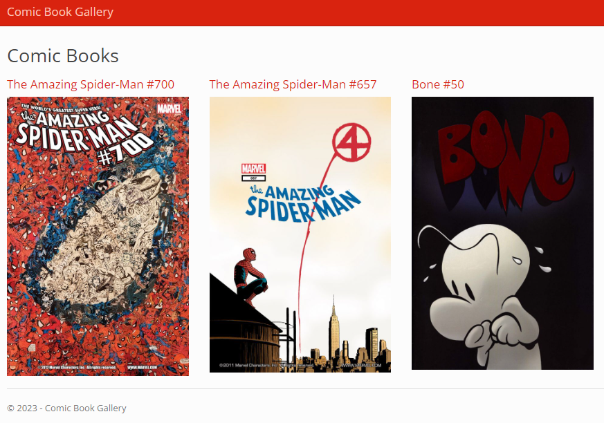\
Book Detail\
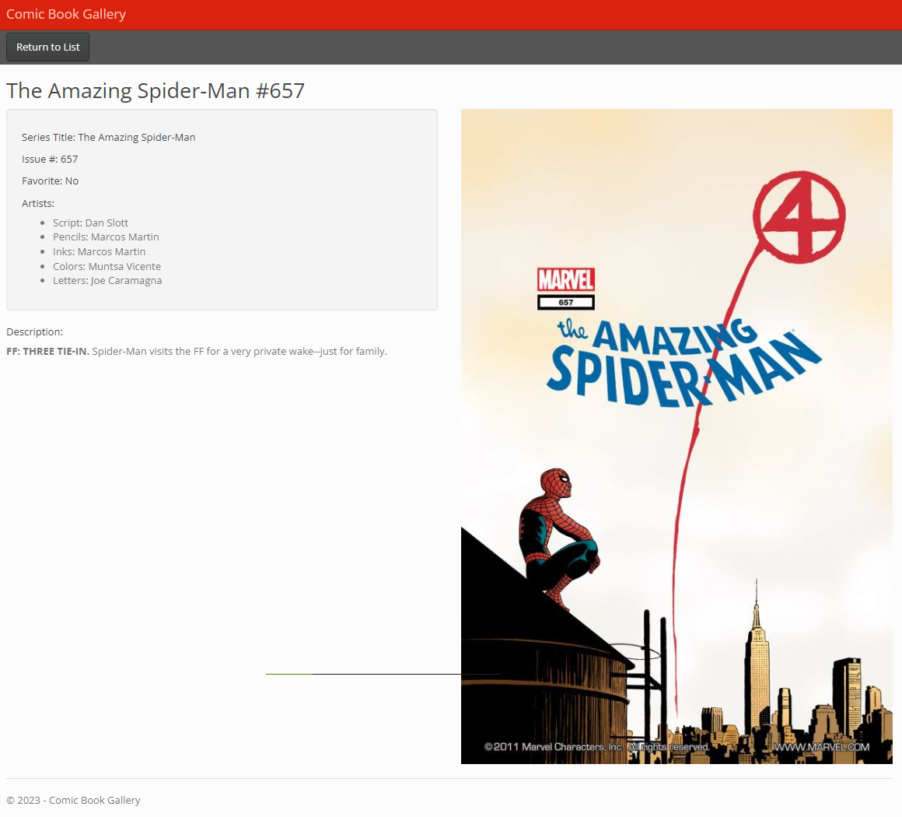

## ComicBookManager
This is a console app to do CRUD operations in a database.\
Home\
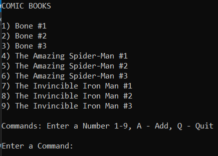\
Book Detail\
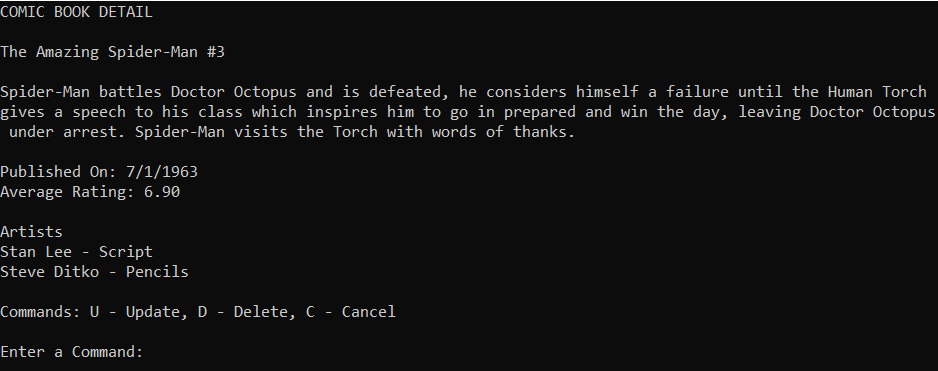\
Add\
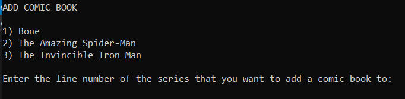

## CommicBookWebManager
This is a web app to do CRUD operations in a database.
### Comic Books
Starting Page\
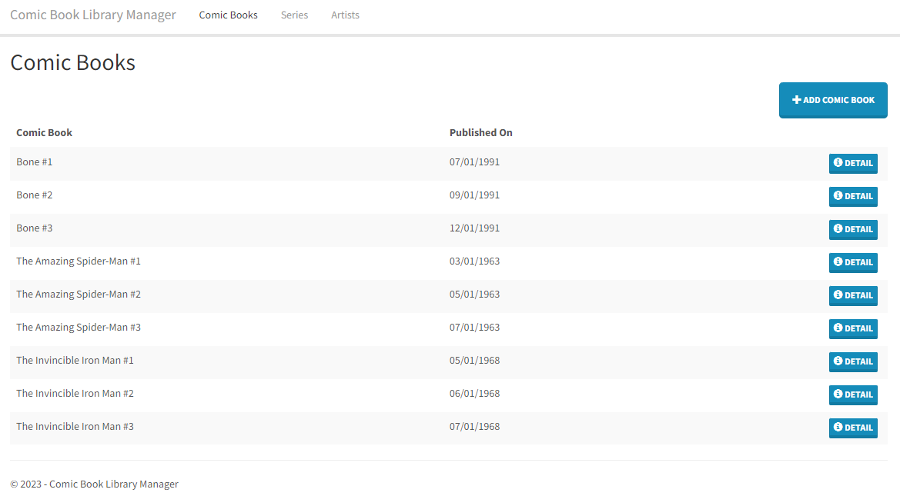\
Book Detail\
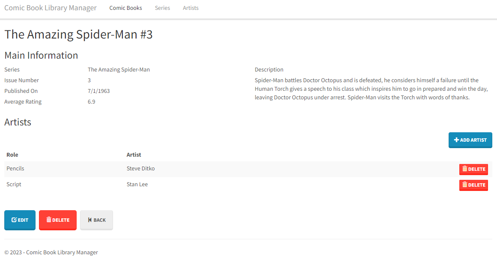\
Edit Comic Book\
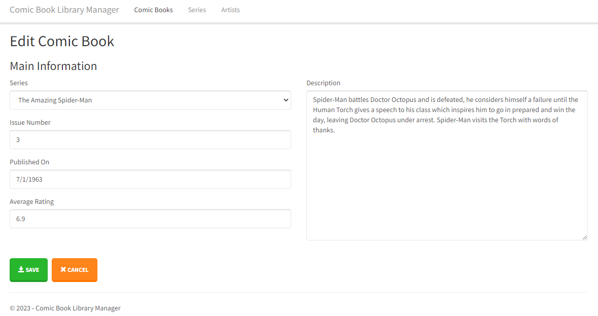\
Add Comic Book Artist
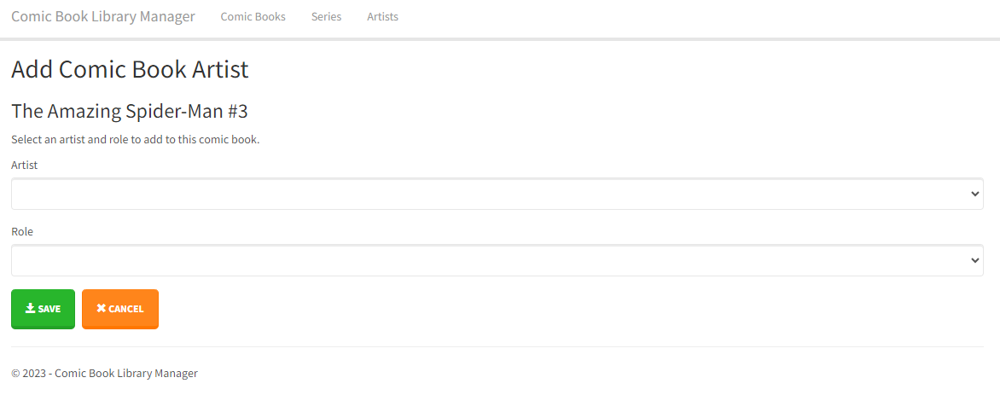
### Series
Series Home\
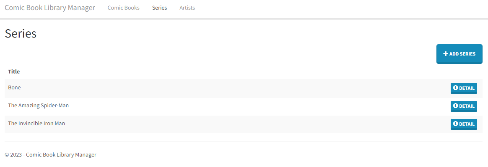\
Series Detail\
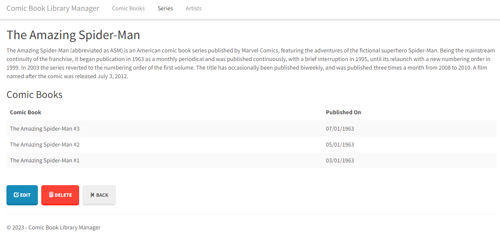\
Edit Series\
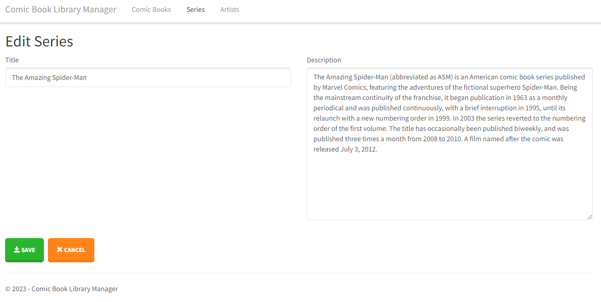
### Artist
Artist Home\
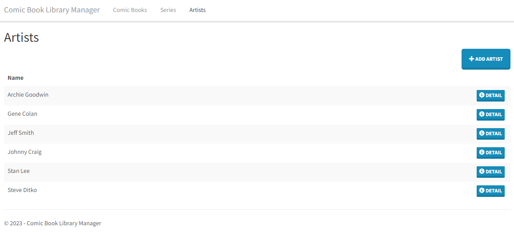\
Artist Detail\
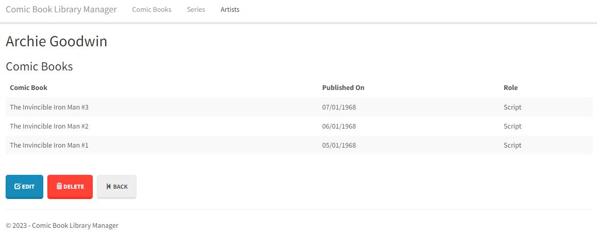\
Edit Artist\
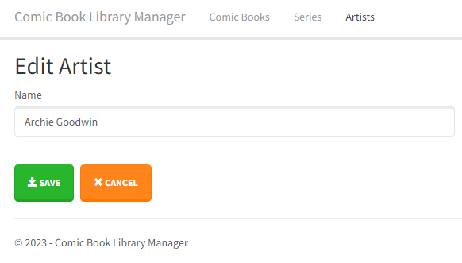

## Acknowledgement
I followed three courses of James Churchill from Treehouse to develop these models as my learning journey. The courses are:
1. ASP.NET MVC Basics
2. Entity Framework Basics
3. Entity Framework with ASP.NET MVC
